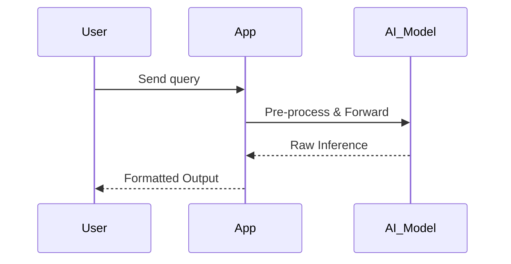

# 💬 Chat Bot (Variant)

A specialized Python conversational AI bot built for testing advanced NLP workflows and data pipelines.

## 🏗 Architecture Flow
The application provides a modular approach to building chat interfaces, primarily orchestrating logic via `app.py` and `main.py`.
- **Execution Pipeline**: User inputs are processed synchronously, logged, and passed to the designated AI models.
- **Testing**: Includes a dedicated `test.py` suite for validating agent responses and edge cases.
- **Documentation**: Step-by-step processes are logged in `steps.txt`.



## 🚀 Getting Started

1. **Clone & Setup Environment**
   Ensure Python 3.9+ is installed.
   ```bash
   pip install -r requirements.txt
   ```

2. **Run Tests**
   ```bash
   python test.py
   ```

3. **Start the Bot**
   ```bash
   python main.py
   ```
